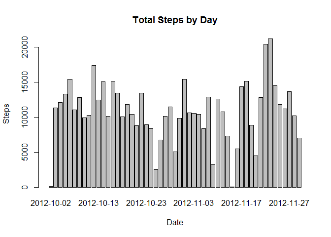
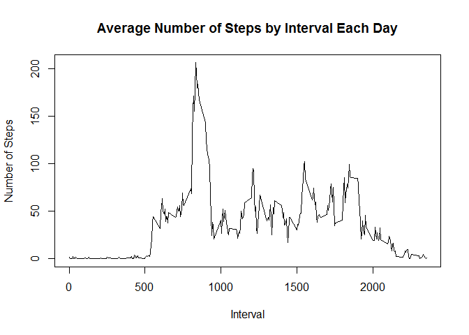
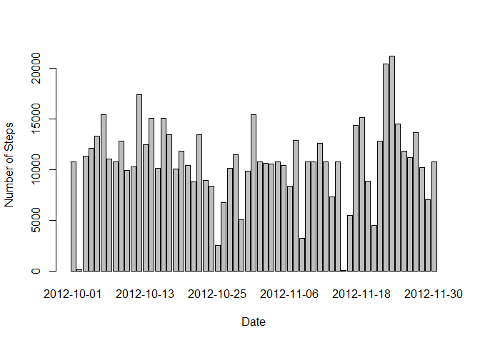
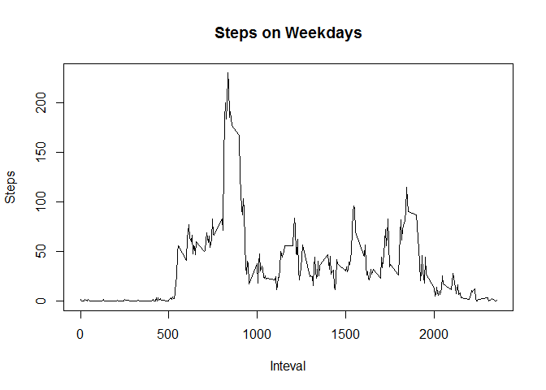
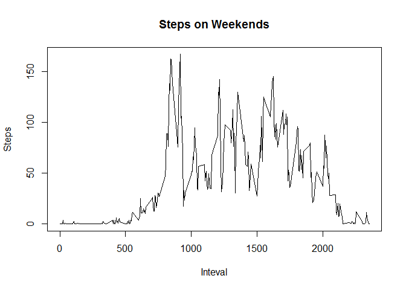

# Reproducible Research: Peer Assessment 1
Suman Challagulla  
Nov 10th, 2014  

###Summary
This is the first assessment for the **Reproducible Research** course in Coursera. The goal of this assessment is to analyze data from [FitBit](http://fitbit.com) to answer a number of questions and to make this data analysis reproducible through an R markdown document. 

##Data
The data for this assignment was downloaded from the course web site:

* Dataset: [Activity monitoring data](https://d396qusza40orc.cloudfront.net/repdata%2Fdata%2Factivity.zip) [52K]

The variables included in this dataset are:

* **steps**: Number of steps taking in a 5-minute interval (missing
    values are coded as `NA`)

* **date**: The date on which the measurement was taken in YYYY-MM-DD
    format

* **interval**: Identifier for the 5-minute interval in which
    measurement was taken

The dataset is stored in a comma-separated-value (CSV) file and there are a total of 17,568 observations in this dataset.

## Loading and preprocessing the data
1. Download the data
2. Load the data into a dataframe


```r
if(!file.exists("activity.zip")) {
        downloadFile <- tempfile()
        download.file("https://d396qusza40orc.cloudfront.net/repdata%2Fdata%2Factivity.zip", dwonloadFile)
        unzip(downloadFile)
}
activityData <- read.csv("activity.csv")
```

## What is mean total number of steps taken per day?
1. Make a histogram of the total number of steps taken each day
    

```r
stepsSumByDate <- aggregate(steps ~ date, activityData, sum)
barplot(stepsSumByDate$steps, names.arg = stepsSumByDate$date, xlab = "Date", ylab = "Steps", main = "Total Steps by Day")
```

 

2. Calculate and report the mean and median total number of steps taken per day

```r
activityMean <- mean(stepsSumByDate$steps)
activityMedian <- median(stepsSumByDate$steps)
```
The `mean` is 1.0766189\times 10^{4} and the `median` is 10765.

## What is the average daily activity pattern?
1. Make a time series plot of the 5-minute interval (x-axis) and the average number of steps taken, averaged across all days (y-axis)

```r
stepsInterval <- aggregate(steps ~ interval, activityData, mean)
plot(stepsInterval$interval,stepsInterval$steps, type="l", xlab="Interval", ylab="Number of Steps",main="Average Number of Steps by Interval Each Day")
```

 

2. Which 5-minute interval, on average across all the days in the dataset, contains the maximum number of steps?

```r
maxStepsInterval <- stepsInterval[which.max(stepsInterval$steps), 1]
```
The 5-minute interval, on average across all the days in the data set, containing the maximum number of steps is 835.

## Impute missing values. Compare imputed to non-imputed data.
Note that there are a number of days/intervals where there are missing values (coded as NA). The presence of missing days may introduce bias into some calculations or summaries of the data.

1. Calculate and report the total number of missing values in the dataset (i.e. the total number of rows with NAs)


```r
missingValues <- sum(is.na(activityData))
```
The total number of missing values is 2304.

2. Devise a strategy for filling in all of the missing values in the dataset. 

Missing values were imputed by using the average for each interval. 


```r
activityData <- merge(activityData, stepsInterval, by = "interval", suffixes = c("", ".y"))
nas <- is.na(activityData$steps)
activityData$steps[nas] <- activityData$steps.y[nas]
activityData <- activityData[, c(1:3)]
```

3. Create a new dataset that is equal to the original dataset but with the missing data filled in.


```r
stepsByDateComplete <- aggregate(steps ~ date, data = activityData, FUN = sum)
```

4. Make a histogram of the total number of steps taken each day and Calculate and report the mean and median total number of steps taken per day. Do these values differ from the estimates from the first part of the assignment? What is the impact of imputing missing data on the estimates of the total daily number of steps?


```r
barplot(stepsByDateComplete$steps, names.arg = stepsByDateComplete$date, xlab = "Date", ylab = "Number of Steps")
```

 

```r
completeDataMean <- mean(stepsByDateComplete$steps)
completeDataMedian <- median(stepsByDateComplete$steps)

diffMean <- completeDataMean - activityMean
diffMedian <- completeDataMedian - activityMedian
```
The `mean` is 1.0766189\times 10^{4} and the `median` is 1.0766189\times 10^{4}.
The difference in the means of the incomplete data and imputed data is 0. 
The difference in the medians of the incomplete data and imputed data is 1.1886792. 
So it appears that there isn't much of an impact by imputing missing data. 

## Are there differences in activity patterns between weekdays and weekends?
1. Create a new factor variable in the dataset with two levels – “weekday” and “weekend” indicating whether a given date is a weekday or weekend day.

This is a function to figure out whether a day is in the work week or the weekend. 

```r
daytype <- function(date) {
        if (weekdays(as.Date(date)) %in% c("Saturday", "Sunday")) {
                "weekend"
        } else {
                "weekday"
        }
}
activityData$daytype <- as.factor(sapply(activityData$date, daytype))
```

2. Make a panel plot containing a time series plot (i.e. type = "l") of the 5-minute interval (x-axis) and the average number of steps taken, averaged across all weekday days or weekend days (y-axis).


```r
stepsWeekday <- aggregate(steps ~ interval, data = activityData, subset = activityData$daytype == "weekday", FUN = mean)
plot(stepsWeekday, type = "l", main = "Steps on Weekdays", xlab="Inteval", ylab="Steps")
```

 

```r
stepsWeekend <- aggregate(steps ~ interval, data = activityData, subset = activityData$daytype == "weekend", FUN = mean)
plot(stepsWeekend, type = "l", main = "Steps on Weekends", xlab="Inteval", ylab="Steps")
```

 

Morning activity is higher during weekdays as compared with weekends. However, overall activity is higher on weekends.
